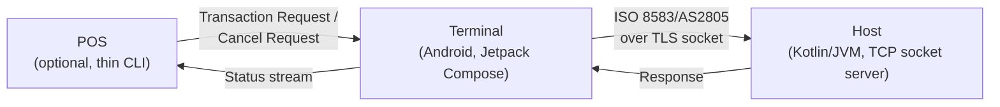

# Payment Transaction Simulator

A simulated payment transaction lifecycle — **Terminal → Host**, with an optional **POS** as an upstream trigger — built to demonstrate payment-domain and Android/Kotlin engineering depth: ISO 8583/AS2805 message handling, a real terminal-side state machine (timeouts, reversals, offline approval), and Jetpack Compose/Coroutines architecture.

> **Scope note:** Host-side logic implements the *published* ISO 8583/AS2805 standard only — no employer-proprietary logic. Crypto/key handling (DUKPT/MAC/PIN block) and EMV logic are conceptual simulations for demonstration purposes, not production-grade or certified implementations. The POS-facing protocol is an original design, not modeled on any real POS-to-terminal protocol.

## Why this exists

This project reflects real experience with terminal-to-host payment integration (WiFi/socket transport, ISO 8583 messaging) rebuilt from scratch against the public standard, as a portfolio piece demonstrating both payments-domain knowledge and modern Android application architecture.

## Architecture

- **Host** is a single simulated endpoint (no separate Issuer/Acquirer split) that authorizes or declines transactions against a simulated in-memory Account store.
- **Terminal** is the center of the system: it can start a transaction standalone (operator-initiated, no POS required) or be triggered by POS, runs a full transaction state machine (card presentment → authorization → approve/decline, with automatic reversal on timeout and offline approval under a floor limit), and talks to Host over ISO 8583/AS2805.
- **POS** is optional and thin — it triggers or cancels a transaction and watches a simplified status stream, but Terminal works fully without it.

Full domain model and terminology: [`CONTEXT-MAP.md`](./CONTEXT-MAP.md) and the per-module `CONTEXT.md` files ([host](./host/CONTEXT.md), [terminal](./terminal/CONTEXT.md), [pos](./pos/CONTEXT.md)).

## Key design decisions

Captured as ADRs in [`docs/adr`](./docs/adr):

- [0001](./docs/adr/0001-simulated-account-store-for-host-decisioning.md) — Simulated account store for Host approve/decline decisioning
- [0002](./docs/adr/0002-terminal-standalone-before-pos-integration.md) — Terminal supports standalone operation; POS is optional
- [0003](./docs/adr/0003-pos-facing-status-vocabulary.md) — POS receives a streamed, collapsed status vocabulary
- [0004](./docs/adr/0004-floor-limit-offline-financial-advice.md) — Floor-limit offline approval with retried Advice/Reversal delivery
- [0005](./docs/adr/0005-terminal-host-transport.md) — Terminal↔Host transport: TCP socket, one-way TLS
- [0006](./docs/adr/0006-pos-terminal-transport-security.md) — POS↔Terminal transport security: one-way TLS, Terminal as server
- [0007](./docs/adr/0007-terminal-module-split.md) — Terminal splits into domain/data/ui/app Gradle modules

## Tech stack

| Module | Stack |
|---|---|
| Host Simulator | Pure Kotlin/JVM, TCP socket server, one-way TLS |
| Terminal App | Android, Jetpack Compose, Coroutines/Flow, ViewModel/StateFlow, Hilt, Navigation Compose, Material 3 |
| POS Simulator | Thin Kotlin/JVM console/CLI client |

Single multi-module Gradle build. Host and POS are each one module (`:host`, `:pos`); Terminal splits into four (`:terminal:domain`, `:terminal:data`, `:terminal:ui`, `:terminal:app`) — a literal, browsable Clean Architecture layering, not just a described principle.

## Status

Domain modeling and architecture planning complete (see ADRs above). Implementation is sequenced **Host → Terminal (standalone mode first, POS integration after) → POS Simulator**, per [`CLAUDE.md`](./CLAUDE.md). Build/run instructions will be added here as each module lands.

Work is tracked as [GitHub Issues](https://github.com/samirshrestha/payment-transaction-simulator/issues) and on the [Project board](https://github.com/users/samirshrestha/projects/1).

## License

[MIT](./LICENSE)
